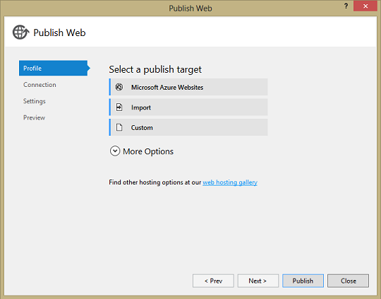

# Deployment

## Publishing From Visual Studio

Right-click a WebSharper web project node in the Solution Explorer,
and select `Publish...` to open the "Publish Web" dialog.

To publish to Azure, click "Microsoft Azure Websites" and log in with
your Microsoft account if prompted.

To use Web Deploy or publish to local folder, local network or FTP,
click "Custom".

Warning: if you are deploying an F# web project (for example created
by the Client-Server Web Application or Single-Page Application templates),
you might get an error about "Exception in executing publishing" when
first creating a publish profile.
This is probably because F# web projects are not fully supported in
Visual Studio right now.
Ignore this, running publish again with the created profile should work.
