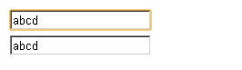
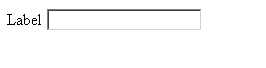
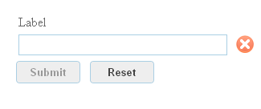
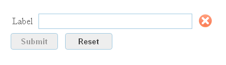
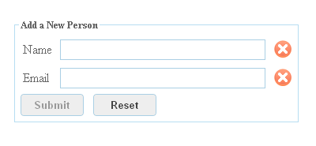
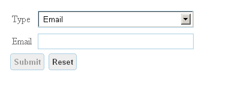

# Developing with Formlets

The WebSharper Formlets library provides a high-level abstraction for
working with web forms and constructing interactive user interfaces.

One of the most common tasks in web development is creating web forms
for collecting user data.  Among other things this involves:

* Creating forms to collect data.
* Looking up the submitted data on the server.
* Validating data.
* Providing validation feedback to the user.

Formlets address all of the above tasks.  The advantages of using
formlets for web-form construction are:

### Type Safety

Every `Formlet<'T>` collects data of type `'T`, preventing typing
errors.  The data type is not limited to primitive values, and often
includes convenient to consume records and unions.

### Composabilty

Complex formlets are built from simple components.  In basic
composition, two formlets `Formlet<'T1>` and a `Formlet<'T2>` can be
combined into a `Formlet<'T3>` using a function `'T1->'T2->'T3`.
Additional formlet composition methods allow to express wizard-like
workflows.

### Reusability

Once defined, a formlet may be reused as a component of many other
formlets and pages.

### Validation

Formlets are aware of the need to validate the collected data and
provide interactive feedback to the user.

### Declarative Style

Formlets are defined in a declarative way, meaning that you only need
to specify the descriptive parts of your form applications, i.e. which
controls to include, what validation logic to apply and how to
aggregate the result of the sub-forms.  All the tedious work of
creating HTML elements, extracting the form data and displaying error
messages is automated.

## Overview

The Formlets library contains a set of components for creating
primitive form controls, composing formlets, adding validation, and
enhancing formlets in various ways.

### Primitive Formlet Controls

In the `Control` module you find a set of predefined formlets
corresponding to some basic web form components such as input text
fields, text areas and check boxes.

As an example, the `TextArea` formlet is exposed as a function from
the default value to a `Formlet<string>`.

    let textForm = Controls.TextArea ""
    let selForm = 
        [ "Option A", "A"; "Option B", "B" ]
        |> Controls.Select 0 
    let buttoForm = Controls.Button "Click"

### Formlet Composition

The most important property of formlets is the ability to build
complex formlets by composing simpler ones.

### Static Composition

The `Formlet.Yield` and `Formlet.Apply` (or `<*>`) functions provide
the default way to combine formlets.  `Formlet.Yield` accepts a
function specifying how to combine the values of several formlets, and
`Formlet.Apply` incrementally provides the formlets to compose.

A composed formlet `Formlet.Yield f <*> g1 <*> g2 .. <*> gn` at any
point in time carries the value of `f g1.value g2.value... gn.value`.
Visually it renders as a concatenation of the component formlets `g1
.. gn`.

In the following example two string formlets are composed:

    [<JavaScript>]
    let ComposedFormlet: Formlet<string> =
        Formlet.Yield (fun x y -> x + " " + y)
        <*> Controls.Select ["Email", "E"; "Mail", "M"] 0
        <*> Controls.Input ""

The value of the `ComposedFormlet` is the concatenation of the
component formlet values.  The result looks like this:

Formlets are closed under composition. This means that
`ComposedFormlet` may itself be composed with other formlets.

### Dynamic Composition

Dynamic/Dependent formlets are formlets that depend on the values
produced by some other formlet.  You can specify such dependencies
using F# computation expressions:

    [<JavaScript>] 
    let DependentFormlet () = 
        Formlet.Do {
            let! x = Controls.Input ""
            return! Controls.Input x 
        }

The formlet above uses the values produced by the first text-box as
input when constructing an additional (dependent) text-box.

### Enhancing Formlets

The `Enhance` module provides a set of predefined functions for
enhancing formlets with additional properties.

Common for these functions is that they accept a formlet of type `T`
along with additional arguments as an input and return a formlet of
the same type extended with some properties.

As an example, the `Enhance.WitTextLabel` accepts a string value
corresponding to the label, and a formlet, returning a new formlet
with a label.

    [<JavaScript>]
    let LabeledFormlet =
        let label = Text "Label"
        Controls.Enhance.WithLabel label (Control.Input "")

The function `Control.Enhance.WithLegend` has a similar signature but
instead of returning a formlet with a label, the body of the formlet
is wrapped within an HTML `legend` element, visually creating a small
box around the formlet.

You may also apply several transformation functions for enhancing
formlets in different ways. Below is an example combining the
`Enhance.WithTextLabel` and `WithSubmitAndResetButtons` functions for
creating a text field formlet with a legend enhanced with submit and
reset buttons:

    let InputForm =
        Controls.Input ""
        |> Enhance.WithTextLabel "Label"
        |> Enhance.WithSubmitAndResetButtons
        |> Enhance.WithFormContainer

Note that the order in which the functions are applied is important.

### Adding Validation

By adding validation you restrict the admissible formlet values by
putting the formlet into a failing state whenever the current value is
invalid.  Among other things, this means that the formlet cannot be
submitted since no value is available. Some predefined validators are
found in the `Validator` module.  Here is an example enhancing a
text-box formlet with validation requiring that the input string is
not empty:

    let ValidationForm =
         Controls.Input ""
         |> Enhance.WithTextLabel "Label"
         |> Validator.IsNotEmpty "Enter non-empty value"
         |> Enhance.WithValidationIcon
         |> Enhance.WithSubmitAndResetButtons
         |> Enhance.WithFormContainer

### Layout

Each formlet carries a layout-manager responsible for rendering the
visual components produced when running the formlet.  You can use the
function `Formlet.WithLayout` to specify the layout manager to be
used. Three default layout managers are provided:

* `Layout.Vertical` - Lays out components vertically.

* `Layout.Horizontal` - Lays out components horizontally.

* `Layout.Flowlet` - Creates a wizard-like interface where subsequent
  components replace the previous ones.
     
Instead of using the `Formlet.WithLayout` the above layouts may be
applied directly via the functions `Formlet.Vertical`,
`Formlet.Horizontal` and `Formlet.Flowlet`.

### Displaying Formlets

Since formlets implement the `IPagelet` interface, they may be
directly embedded inside HTML combinators:

    [<JavaScript>] 
    let Main () =
        Div [
            Controls.Input "Text-field formlet in div tag"
        ]

If you want to handle the values produced by a formlet, you may use
the `Run` method. It accepts a handler that is invoked every time a
new value is produced by the formlet, and returns an `IPagelet`
instance corresponding to the form body:

    [<JavaScript>] 
    let Main () =
        let input = 
            Controls.Input ""
            |> Enhance.WithSubmitButton
        Div [
            input.Run (fun s -> 
                processResult s
            )
        ]

## Examples

### Statically Composed Formlet

Below is an example of a formlet for entering name and email
information:

    type Person = {
        Name: string
        Email: string
    } 
    
    [<JavaScript>]
    let PersonFormlet : Formlet<Person> = 
        let nameF = 
            Controls.Input "" 
            |> Validator.IsNotEmpty "Empty name not allowed" 
            |> Enhance.WithValidationIcon
            |> Enhance.WithTextLabel "Name"
        let emailF = 
            Controls.Input ""
            |> Validator.IsEmail "Please enter valid email address" 
            |> Enhance.WithValidationIcon
            |> Enhance.WithTextLabel "Email"
        Formlet.Yield (fun name email -> {Name = name; Email = email})
        <*> nameF 
        <*> emailF
        |> Enhance.WithSubmitAndResetButtons
        |> Enhance.WithLegend "Add a New Person"
        |> Enhance.WithFormContainer
    
    [<JavaScript>]
    let Main () =
        Div [PersonFormlet]
        
`PersonFormlet` defines a formlet parameterized with the user-defined
type `Person`. It contains validation logic to guarantee that the
`Name` field is not empty and the email address is of the correct
format.

## Dependent Formlet

Below is an exmaple of using computation expressions to define a
dependent formlet:

    type ContactData =
        | Phone of string
        | Email of string

    [<JavaScript>]
    let ContactFormlet : Formlet<ContactData> =
        let phone =
            Controls.Input ""
            |> Enhance.WithTextLabel "Phone"
            |> Formlet.Map Phone
        let email =
            Controls.Input ""
            |> Validator.IsEmail "Please enter a valid email address."
            |> Formlet.Map Email
            |> Enhance.WithTextLabel "Email"
        Formlet.Do {
            let! contactTypeFormlet =
                Controls.Select 0 [("Phone", phone); ("Email", email)]
                |> Enhance.WithTextLabel "Type"
            return! contactTypeFormlet
        }
        |> Enhance.WithSubmitAndResetButtons
        |> Enhance.WithFormContainer

This formlet will interactively present either the `phone` or `email`
form depending on the user's choice in the select box.  Each time the
user changes the selected option, the dependent form is updated.

