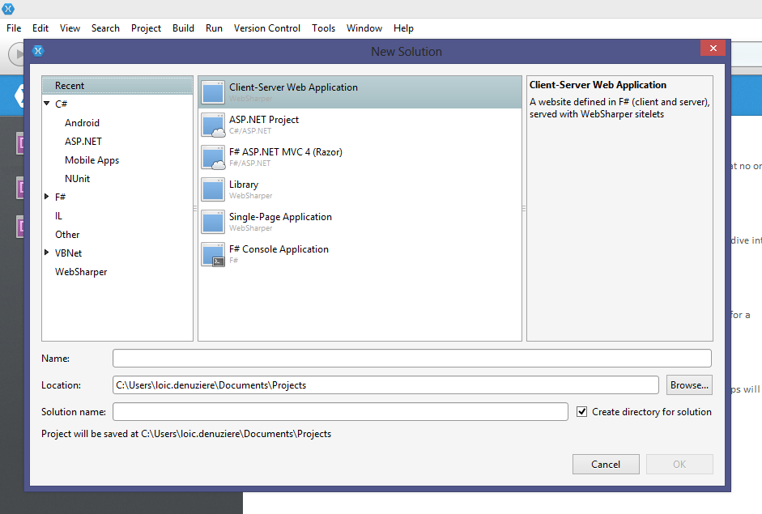

# Getting started with WebSharper for C# #

This article will walk you through getting a "hello world" WebSharper
example up and running.

## Creating a project

### With Visual Studio

After completing [the installation](Install.md), open Visual Studio and create a new project ("Website"):

    File > New Project > Templates > Visual C# >
    WebSharper > UI.Next Client-Server Web Application

This project defines a simple website, with both server and
client-side components.  To try it out, simply "Run" (F5) - you should
now see the code in action:

### With MonoDevelop / Xamarin Studio

After completing [the installation](http://websharper.com/docs/install-xs), open MonoDevelop / Xamarin Studio and create a new project ("Website"):

    File > New > Solution... >
    WebSharper > UI.Next Client-Server Web Application

This project defines a simple website, with both server and
client-side components.  To try it out, simply "Run" (F5) - you should
now see the code in action:

## The project files

Let us look at what the code does.

### Client class

This is the most interesting class (see `Client.cs`). Having it
marked `[JavaScript]` makes WebSharper cross-compile all code in
this module to JavaScript and run it in the browser.

The `Main` method is what is invoked as the client-side point. It
generates some DOM elements dynamically and these get inserted in the
page where the server definition places it.

The `ClearNames` method is used in the handler for a button click.
This method is also only referenced in the server-side construction
of the page.

### Remoting class

This module (`Remoting.cs`) defines the `GetNames` function that is
executed on the server but is also available on the client. Execution
happens by serializing arguments (empty in this case) and return value and passing them
over HTTP.  Not all types are supported, WebSharper will warn you
about potential problems at compile time.

### Server class

The main module (`Server.cs`) defines the page structure of your
website, which is now a sigle fallback function that accepts any sub-url, and passes
this argument to the client-side (initializing the text box).

As you are starting out, you may just consider this boilerplate and
focus on programming the client-side logic. For diving deeper,
reference documentation is available by topic in the manual.
