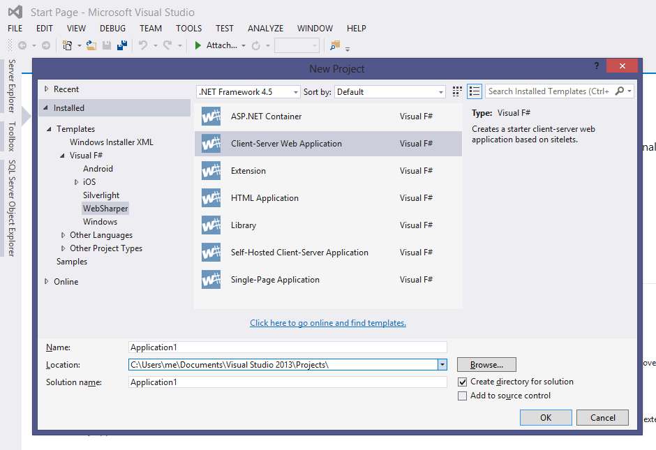
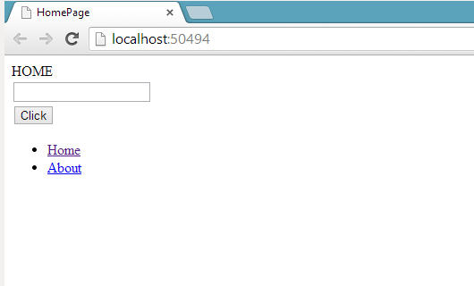

# Getting Started with WebSharper

This article will walk you through getting a "hello world" WebSharper
example up and running.

After completing the installation, open Visual Studio and create a new
project ("Website"):

    File > New Project > Templates > Visual F# >
    WebSharper > Client-Server Web Application

This project defines a simple website, with both server and
client-side components.  To try it out, simply "Run" (F5) - you should
now see the code in action:

Let us look at what the code does.

## Client Module

This is the most interesting module (see `Client.fs`). Having it
marked `[<JavaScript>]` makes WebSharper cross-compile all code in
this module to JavaScript and run it in the browser.

The `Main` method is what is invoked as the client-side point. It
generates some DOM elements dynamically and these get inserted in the
page.

The `Start` method is used in the handler for a button click. It sends
some client-side data to the server for processing and returns it back
asynchronously.

## Remoting Module

This module (`Remoting.fs`) defines the `Process` function that is
executed on the server but is also available on the client. Execution
happens by serializing arguments and return value and passing them
over HTTP.  Not all types are supported, WebSharper will warn you
about potential problems at compile time.

## Main Module

The main module (`Main.fs`) defines the page structure of your
website, the main HTML template to use, server-side markup to
generate, and finally marks these definitions as default by using an
assembly attribute.

As you are starting out, you may just consider this boilerplate and
focus on programming the client-side logic. For diving deeper,
reference documentation is available by topic in the manual.

## Main Template

The `Main.html` file provides the overall template that is by default
applied to every page of your website.  You can edit the HTML to
adjust the overall layout and look-and-feel.
