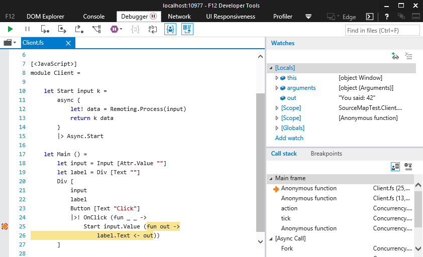
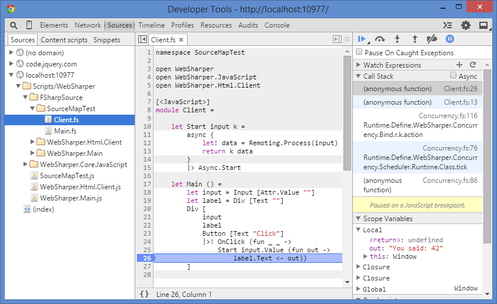

# Source maps

## Embedding source maps in WebSharper libraries

You can enable including source maps and the required source files
in a WebSharper assembly, by adding the

    <WebSharperSourceMap>True</WebSharperSourceMap>

property to your project file.

WebSharper itself and all publix  is built with source map embedding, so you can debug into
WebSharper library code.

## Outputting source maps for WebSharper web projects

If you have a separate web project hosting your WebSharper application,
add the same `WebSharperSourceMap` property to the project file to unpack
the source map files.

## Usage

### Internet Explorer & Microsoft Edge

You need to have Internet Explorer 11 on Windows 8.1 Update 1 or newer
for source map support.
Edge has inherited the debugging tool from IE11, works similarly.

In the Debugger tab of F12 tools, the last icon in the toolbar says
"Load the sources mapped to this generated file".
Use this to jump between generated and original source code.
You can set breakpoints in the original code.

### Google Chrome

To enable source maps, check the "Enable JavaScript source maps" 
setting in Developer Tools Settings (cog icon in F12 panel).

In the Sources tab of Developer Tools, open a generated `.js` file in 
the `Scripts/WebSharper` folder to make Chrome load its source mappings.
A folder named `Source` will appear with the original `.fs` files used
for WebSharper translation.
You can use this to set breakpoints in original code.

### Mozilla Firefox

Check the "Show Original Sources" item in the "Debugger Options"
menu (cog icon in F12 panel).

You can access the list of original sources, however breakpoints
don't work correctly as of version 37.0.1.

### Limitations

* You cannot have multiple source files with the same file name in a single project.

* Inlines are not mapped.
